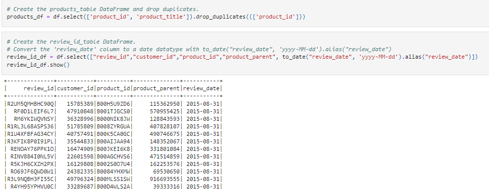

# Amazon_Vine_Analysis
Module 16 Challenge

## Overview

Due to our success with our Sellby project, we have been tasked with analyzing Amazon reviews written by members of the paid Amazon Vine program. The Amazon Vine program is a service that allows manufacturers and publishers to receive reviews for their products. Companies like SellBy pay a small fee to Amazon and provide products to Amazon Vine members, who are then required to publish a review.

In this project, we will choose a dataset that contains reviews of specific products.  The dataset that we have selected to analyze is one related to Tools. We will need to use PySpark to perform the ETL process to extract the dataset, transform the data, connect to an AWS RDS instance, and load the transformed data into pgAdmin. Then we will use PySpark to determine if there is any bias toward favorable reviews from Vine members in your dataset. Then, you’ll write a summary of the analysis for Jennifer to submit to the SellBy stakeholders.

### Purpose

The purpose of this project is to utilize skills learned during this module to retrieve data, ETL the data, load it to a RDS instance, pull a subset of the data from the database and analyze the data to see if there is an impact on the number of 5 star reviews made by paid and unpaid vine users through data acquired from Amazon S3 services.  To complete this analysis, we will use Postgres RDS through Amazon's AWS, S3, PySPark, and Python.

#### Deliverable One

For the first deliverable, Jennifer and I decided to run our analysis on the Tools dataset that we found on Amazon Review, which has over 50 datasets to choose from. We will parse this data into several dataframes and then load create a database and load the dataframes as tables into the database.  We loaded this dataset into a dataframe created using PySpark and Google Collab.  As can be seen in the image below:

Next, once the dataset loaded, we performed the following steps:
* Run an ETL to create a dataframe that is specific to the Customers
* Run an ETL to create a dataframe that is specific to the Products
* Run an ETL to create a dataframe that is specific to the Reviews
* Run an ETL to create a dataframe that is specific to the Vines

The images below show the creation of the dataframes per the specific table

 

This image shows the code snippet used to push the dataframes created up to the database as tables.

These images shows the results after running SQL queries to show that the data was loaded into the tables properly. 
  
   

#### Deliverable Two
