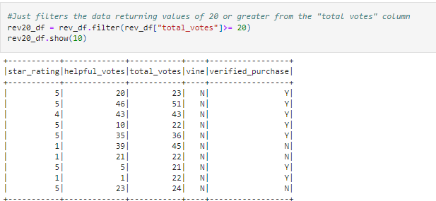

# Amazon_Vine_Analysis
Module 16 Challenge

## Overview

Due to our success with our Sellby project, we have been tasked with analyzing Amazon reviews written by members of the paid Amazon Vine program. The Amazon Vine program is a service that allows manufacturers and publishers to receive reviews for their products. Companies like SellBy pay a small fee to Amazon and provide products to Amazon Vine members, who are then required to publish a review.

In this project, we will choose a dataset that contains reviews of specific products.  The dataset that we have selected to analyze is one related to Tools. We will need to use PySpark to perform the ETL process to extract the dataset, transform the data, connect to an AWS RDS instance, and load the transformed data into pgAdmin. Then we will use PySpark to determine if there is any bias toward favorable reviews from Vine members in your dataset. Then, you’ll write a summary of the analysis for Jennifer to submit to the SellBy stakeholders.

### Purpose

The purpose of this project is to utilize skills learned during this module to retrieve data, ETL the data, load it to a RDS instance, pull a subset of the data from the database and analyze the data to see if there is an impact on the number of 5 star reviews made by paid and unpaid vine users through data acquired from Amazon S3 services.  To complete this analysis, we will use Postgres RDS through Amazon's AWS, S3, PySPark, and Python.

#### Deliverable One

For the first deliverable, Jennifer and I decided to run our analysis on the Tools dataset that we found on Amazon Review, which has over 50 datasets to choose from. We will parse this data into several dataframes and then load create a database and load the dataframes as tables into the database.  We loaded this dataset into a dataframe created using PySpark and Google Collab.  As can be seen in the image below:

Next, once the dataset loaded, we performed the following steps:
* Run an ETL to create a dataframe that is specific to the Customers
* Run an ETL to create a dataframe that is specific to the Products
* Run an ETL to create a dataframe that is specific to the Reviews
* Run an ETL to create a dataframe that is specific to the Vines

* The images below show the creation of the dataframes per the specific table

 

* This image shows the code snippet used to push the dataframes created up to the database as tables.

* These images shows the results after running SQL queries to show that the data was loaded into the tables properly. 

* **Customer Table**

  

* **Product Table**

* **Review Table**

 

* **Vine Table**

 

#### Deliverable Two

Now that we have our data in the database, the real fun(work) begins.  Using PySpark, we will pull the data focusing on the Vine table.
The analysis does the following:
There is a DataFrame or table for the vine_table data using one of three methods above (5 pt)
The data is filtered to create a DataFrame or table where there are 20 or more total votes (5 pt)
The data is filtered to create a DataFrame or table where the percentage of helpful_votes is equal to or greater than 50% (5 pt)
The data is filtered to create a DataFrame or table where there is a Vine review (5 pt)
The data is filtered to create a DataFrame or table where there isn’t a Vine review (5 pt)
The total number of reviews, the number of 5-star reviews, and the percentage 5-star reviews are calculated for all Vine and non-Vine reviews (15 pt)

The image below shows the result after pull the data from the vine table in the database to a dataframe.

* Once the data is in the dataframe, we need to perfrom an ETL to only bring in the columns required to conduct the analysis.  To do this, we created another dataframe and selected only the columns that we will use for this analysis.  The screenshot below illustrates this ETL exercise

* From there, to make the data more managable and meaningful, we focuses on instances were there were greater than 20 votes.  We completed this by taking the ETL dataframe and creating a new dataframe that only returns the vote counts that are 20 or greater.  This can be seen below.

* Because we are interested in if the percentage of favorable votes differ from paid or unpaid vine users, we decided to only focus on reviews that were favorable.  To do this, we created another dataframe using data from the 20 votes or greater dataframe to run a calculation that returned data if the number of votes were deemed favorable, greater than 50%.  This can be seen in the screeen shot below.

 
 * We then filtered this dataframe further by creating two additional dataframes that seperated the vine users into two categories.  Paid and Unpaid.  That can be seen by the screeen shots below.
 

*  We then had to calculate the total number of paid vine members and then how many of them gave a rating of 5 stars or better.  We then calculated the percentage of paid vine users that gave 5 star reviews against the paid vine population.  Plus we did a summary to return the count, std. deviation, mean and median of this dataset.

*  We then had to calculate the total number of unpaid vine members and then how many of them gave a rating of 5 stars or better.  We then calculated the percentage of unpaid vine users that gave 5 star reviews against the unpaid vine population.  Plus we did a summary to return the count, std. deviation, mean and median of this dataset.

### Summary

#### Analysis

Working with the following Hypothesis:

* Ho: There are no differences in the percentage of 5 star ratings of paid vine users versus those who were unpaid.
* Ha: The percentages of 5 star rating given by paid vine users are different from percentages of 5 star ratings given by unpaid users.

* Percentage of 5 star rating by paid vine users: **57.19**
* Percentage of 5 star by unpaid users:  **46.33**

* **Findings:** Very interesting results.  Not at all what I expected nor, do I believe the outcome is conclusive.  By looking at the data provided, it appears that there is a difference between the percentage of 5 stars given by paid users versus the percentage of 5 star ratings given by unpaid users.  The paid users tend to give more 5 star ratings, on a percentage basis than unpaid users.  Looking at the summary table for both the paid and unpaid users, the paid users give a higher average of stars, **4.33** than compared to the unpaid users, **3.68**.  Based soley on this information, I would believe one could reject the null hypothesis.  However, I believe this would benefit from further analysis to drill down further to see if there is any statistical relevance to this data.  Conducting a Multivariant regression model or a T-test that would return a p-value would allow a greater level of confidence in the data.  Also, knowing what the internal costumer's limit threshold of what accepts or rejects a hypothesis. Example, greater than 5% swing is where the customer rejects the null hypothesis or could it be 15%.

### Challenges

This was a great project that allowed me use multiple skills acquired over the course of this bootcamp.  I did have an issue with exporting the vine table as a CSV.  The output file did not have the extension of .csv.  From the skills that I have learned in this class, plus using Google Fu, I was able to come up with a work around by writing code that would query the database directly and pull into a dataframe.  That code can be seen below.

